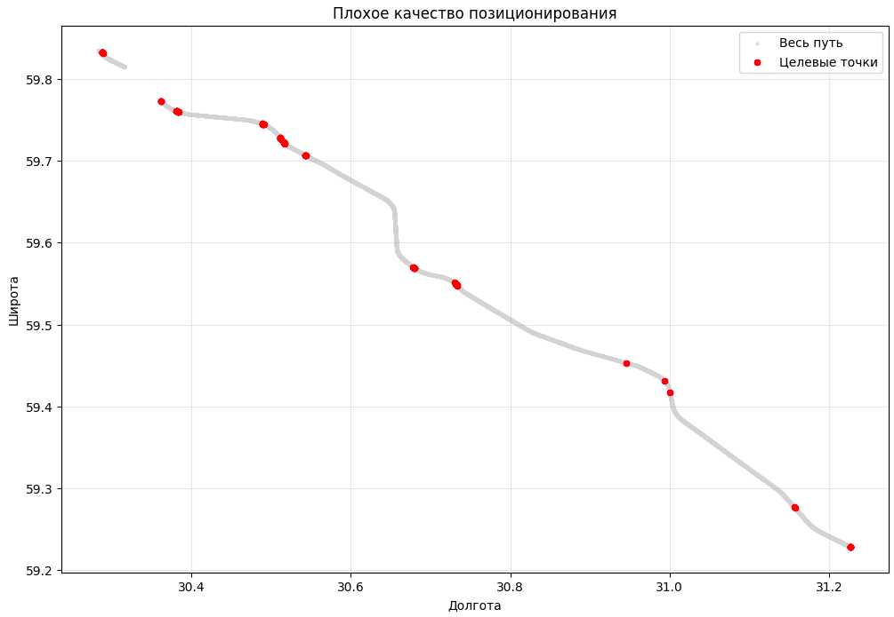
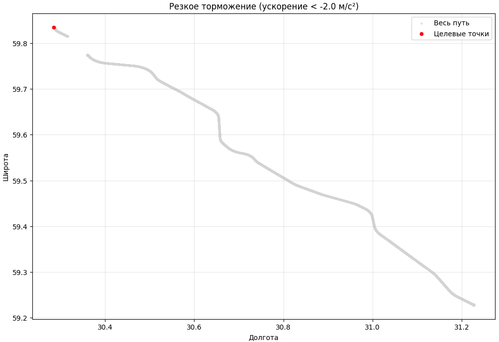
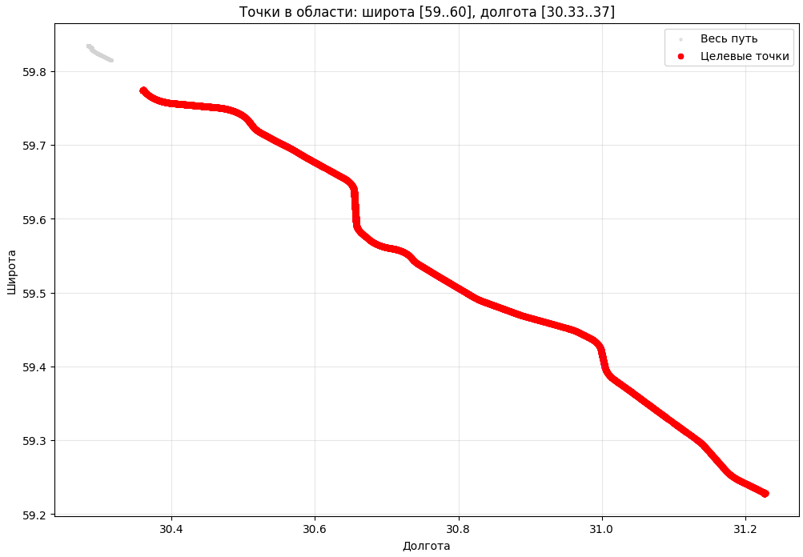

# Semantic Search Engine на примере навигационных данных беспилотного тягача

Микросервис (REST API) на Python, который принимает запросы на естественном языке, анализирует их с помощью LLM и возвращает релевантные данные из набора CSV-файлов с навигационной информацией.
Данные содержат информацию о положении, скорости, ориентации и статусе решения. 

## Структура проекта

```
Semantic-Search-For-Navigation/
├── app/
│   ├── config.py
│   ├── data_loader.py
│   ├── llm_client.py
│   ├── main.py
│   ├── models.py
│   ├── query_executor.py
│   ├── query_parser.py
│   ├── utils.py
│   └── visualize.py
├── data/
│   └── data.csv
├── .env.example
├── docker-compose.yaml
├── DockerFile
├── requirements.txt
└── README.md
```

## Архитектура проекта
```
HTTP POST /query
       │
       ▼
┌──────────────┐     rule-based
│ query_parser │ ──► если нет — LLM
└──────────────┘
       │
       ▼
┌──────────────────────────────────────┐
│           main.py                    │
│  aggregation | filter_bad_position   │
│  time_slice  | braking_events        │
│  geo_filter                          │
└──────────────────────────────────────┘
       │
       ▼
┌──────────────────────────────────────┐
│         query_executor.py            │
│  — работа с DataFrame (pandas)       │
│  — горизонтальная скорость, ускорение│
│  — фильтрация по часам/координатам   │
│  — вызов visualize.py для графика    │
└──────────────────────────────────────┘
       │
       ▼
┌──────────────────────────────────────┐
│            ответ JSON                │
│  + ссылка на картинку                │
│  (http://localhost:8000/static/...)  │
└──────────────────────────────────────┘
```


## Ключевые модули

`config.py` - все параметры в одном месте (границы трассы М11, time_slice сумерек, порог торможения, настройка Open Router и пути);

`query_parser.py` - метод rule-based + LLM. LLM возвращает только тип, а параметры подставляются из конфига;

`visualize.py` - рисует scatter plot маршрута, выделяет целевые точки красным и сохраняет PNG в static/plots/;

`query_executor.py` - каждая функция под один тип запроса.

## Установка и запуск

Через Docker (рекомендовано):

```
git clone https://github.com/HereZDeSanta/Semantic-Search-For-Navigation.git
cd Semantic-Search-For-Navigation

# Скопируй пример переменных окружения и вставь свой API‑ключ
cp .env.example .env
nano .env   # OPENROUTER_API_KEY=sk-or-v1-...

# Постройка
docker compose build

# Запуск
docker compose up
```

Сервис будет доступен по адресу `http://localhost:8000`

Для удобства, можно использовать Swagger UI через поинт /docs: `http://localhost:8000/docs`


Локально:
```
git clone https://github.com/HereZDeSanta/Semantic-Search-For-Navigation.git
cd Semantic-Search-For-Navigation

python3 -m venv venv
source venv/bin/activate
pip install -r requirements.txt
python -m app.main
```

# Принцип работы

## 1. Классификация запроса:

Если в запросе есть фразы, по типу "м11, трасса, сумерки, тормоз", то срабатывает метод срабатывает rule‑based. Его фишка - скорость и без использования LLM. 

Если же подобной фразы нет, то шлём промпт в LLM. LLM возвращает JSON типа `{"type": "aggregation", "metric": "max_speed"}`.

## 2. Обработка запросов:


| Тип | Функция | Что делает |
|-----|---------|------------|
| aggregation | execute_aggregation | max/avg/min скорость |
| filter_bad_position | execute_bad_position | точки c pos_type__type == 19 |
| time_slice | execute_time_slice | фильтр по hour_moscow |
| braking_events | execute_braking_events | acceleration < threshold |
| geo_filter | execute_geo_filter | координаты внутри bounding‑box + группировка в визиты |


## 3. Визуализация:

Для удобства и приятного восприятия, дополнительно была сделана визулазиция в виде графиков через matplotlib.

`plot_route()` рисует весь маршрут (серые точки) и выделенные точки (красные).

Картинка сохраняется в `static/plots/{name}.png`, в JSON возвращается URL типа `/static/plots/20260508_160623_fbdf018b.png`.

Можно открыть в браузере или вставить в HTML.


# Примеры запросов и ответов

## 1. Максимальная скорость:
```
{
  "status": "success",
  "query": "максималка по скорости",
  "result": {
    "max_speed": 89.8,
    "units": "km/h",
    "timestamp": "2023-11-14 13:11:32"
  }
}
```
## 2. Качество позиционирования:
```
{
  "status": "success",
  "query": "покажи, где плохо работал GPS",
  "result": {
    "total_points": 65,
    "percentage_of_trip": 0.8,
    "points": [
      {
        "timestamp": "2023-11-14 11:06:48",
        "latitude": 59.83204227430584,
        "longitude": 30.288462010174268,
        "status": 19,
        "horizontal_speed": 37.3
      },
      {
        "timestamp": "2023-11-14 11:06:51",
        "latitude": 59.83228193151269,
        "longitude": 30.28827539650741,
        "status": 19,
        "horizontal_speed": 31.6
      },
      {
        "timestamp": "2023-11-14 11:06:52",
        "latitude": 59.832350059421344,
        "longitude": 30.288205389405015,
        "status": 19,
        "horizontal_speed": 30.2
      },
      {
        "timestamp": "2023-11-14 11:06:53",
        "latitude": 59.83241138763709,
        "longitude": 30.288122870443026,
        "status": 19,
        "horizontal_speed": 29.6
      },
      {
        "timestamp": "2023-11-14 11:06:54",
        "latitude": 59.83246638951019,
        "longitude": 30.288024439014148,
        "status": 19,
        "horizontal_speed": 29.9
      },
      {
        "timestamp": "2023-11-14 11:16:40",
        "latitude": 59.832128361053805,
        "longitude": 30.288357375281628,
        "status": 19,
        "horizontal_speed": 30.7
      },
      {
        "timestamp": "2023-11-14 11:16:41",
        "latitude": 59.83205446508939,
        "longitude": 30.28840823780988,
        "status": 19,
        "horizontal_speed": 32.1
      },
      {
        "timestamp": "2023-11-14 11:16:48",
        "latitude": 59.831430289327805,
        "longitude": 30.288703720474143,
        "status": 19,
        "horizontal_speed": 39.8
      },
      {
        "timestamp": "2023-11-14 11:51:12",
        "latitude": 59.772400085682335,
        "longitude": 30.36224988994341,
        "status": 19,
        "horizontal_speed": 35.1
      },
      {
        "timestamp": "2023-11-14 11:52:58",
        "latitude": 59.76014251659488,
        "longitude": 30.38263727768141,
        "status": 19,
        "horizontal_speed": 60.2
      },
      {
        "timestamp": "2023-11-14 11:53:00",
        "latitude": 59.75997976486383,
        "longitude": 30.383138636688788,
        "status": 19,
        "horizontal_speed": 60.4
      },
      {
        "timestamp": "2023-11-14 11:53:01",
        "latitude": 59.75990048912548,
        "longitude": 30.38339243795709,
        "status": 19,
        "horizontal_speed": 60.5
      },
      {
        "timestamp": "2023-11-14 11:53:02",
        "latitude": 59.759821841183616,
        "longitude": 30.3836472084352,
        "status": 19,
        "horizontal_speed": 60.3
      },
      {
        "timestamp": "2023-11-14 11:58:27",
        "latitude": 59.74434820804992,
        "longitude": 30.490248517864337,
        "status": 19,
        "horizontal_speed": 78.5
      },
      {
        "timestamp": "2023-11-14 11:58:28",
        "latitude": 59.74422248835551,
        "longitude": 30.49054667399489,
        "status": 19,
        "horizontal_speed": 78.8
      },
      {
        "timestamp": "2023-11-14 11:58:29",
        "latitude": 59.74409535926313,
        "longitude": 30.49084415961922,
        "status": 19,
        "horizontal_speed": 79
      },
      {
        "timestamp": "2023-11-14 12:00:12",
        "latitude": 59.72698965605419,
        "longitude": 30.511611050420612,
        "status": 19,
        "horizontal_speed": 79.1
      },
      {
        "timestamp": "2023-11-14 12:00:13",
        "latitude": 59.72680633960029,
        "longitude": 30.511755605631613,
        "status": 19,
        "horizontal_speed": 79.2
      },
      {
        "timestamp": "2023-11-14 12:00:14",
        "latitude": 59.72662327371565,
        "longitude": 30.511900800391743,
        "status": 19,
        "horizontal_speed": 79.1
      },
      {
        "timestamp": "2023-11-14 12:00:46",
        "latitude": 59.72093674068741,
        "longitude": 30.517296782840884,
        "status": 19,
        "horizontal_speed": 79
      },
      
      {
        "timestamp": "2023-11-14 13:59:28",
        "latitude": 59.7610576145596,
        "longitude": 30.38074515874181,
        "status": 19,
        "horizontal_speed": 73.7
      },
      {
        "timestamp": "2023-11-14 14:00:52",
        "latitude": 59.77306748444513,
        "longitude": 30.36213042687643,
        "status": 19,
        "horizontal_speed": 47.4
      },
      {
        "timestamp": "2023-11-14 14:00:53",
        "latitude": 59.773174138004094,
        "longitude": 30.362033216038792,
        "status": 19,
        "horizontal_speed": 46.7
      }
    ],
    "image": "http://localhost:8000/static/plots/20260509_164559_147eeb83.png"
  }
}
```




## 3. Временной срез (Сумерки):

Поскольку после анализа csv файла, был сделан вывод о том, что таких данных а данном диапазоне нет (16-19), то и ответ остается пустым:
```
{
  "status": "success",
  "query": "покажи, тягач ехал в сумерках",
  "result": {
    "message": "No data between 16:00 and 19:00"
  }
}
```
Но логика работает


## 4. Резкое торможение:
```
{
  "status": "success",
  "query": "резкое торможение",
  "result": {
    "total_braking_events": 1,
    "max_deceleration": -2.2,
    "avg_deceleration": -2.2,
    "events": [
      {
        "timestamp": "2023-11-14 11:07:29",
        "latitude": 59.834587108286605,
        "longitude": 30.28452375845559,
        "deceleration": -2.2,
        "speed_before": 10.9,
        "speed_after": 3
      }
    ],
    "image": "http://localhost:8000/static/plots/20260509_165634_67dd5af2.png"
  }
}
```




## 5. Трасса М-11:
```
{
  "status": "success",
  "query": "Покажи, где тягач двигался по трассе М-11",
  "result": {
    "total_points": 7491,
    "points": [
      {
        "timestamp": "2023-11-14 11:49:53",
        "latitude": 59.774194825572806,
        "longitude": 30.359335360310155
      },
      {
        "timestamp": "2023-11-14 11:49:54",
        "latitude": 59.77419483506158,
        "longitude": 30.359335339134155
      },
      {
        "timestamp": "2023-11-14 11:49:55",
        "latitude": 59.77419483796961,
        "longitude": 30.359335380411817
      },
      {
        "timestamp": "2023-11-14 11:49:56",
        "latitude": 59.77419483211445,
        "longitude": 30.3593353605736
      },
      {
        "timestamp": "2023-11-14 11:49:57",
        "latitude": 59.774194837463575,
        "longitude": 30.35933534061336
      },
      {
        "timestamp": "2023-11-14 11:49:58",
        "latitude": 59.77419480470867,
        "longitude": 30.359335357614164
      },
      {
        "timestamp": "2023-11-14 11:49:59",
        "latitude": 59.77419482509424,
        "longitude": 30.359335358952134
      },
      {
        "timestamp": "2023-11-14 11:50:00",
        "latitude": 59.77419482776946,
        "longitude": 30.35933534759182
      },
      {
        "timestamp": "2023-11-14 11:50:01",
        "latitude": 59.77419484066062,
        "longitude": 30.35933534223283
      },
      {
        "timestamp": "2023-11-14 11:50:02",
        "latitude": 59.77419484367534,
        "longitude": 30.359335344656564
      },
      {
        "timestamp": "2023-11-14 11:50:03",
        "latitude": 59.77419484202113,
        "longitude": 30.359335338538976
      },
      {
        "timestamp": "2023-11-14 11:50:04",
        "latitude": 59.774194823208354,
        "longitude": 30.35933535044481
      },
      {
        "timestamp": "2023-11-14 11:50:05",
        "latitude": 59.77419447950401,
        "longitude": 30.359339780584605
      },
      {
        "timestamp": "2023-11-14 11:50:06",
        "latitude": 59.77419188190305,
        "longitude": 30.35935535878504
      },
      {
        "timestamp": "2023-11-14 11:50:07",
        "latitude": 59.77418890534997,
        "longitude": 30.359371861577788
      },
      {
        "timestamp": "2023-11-14 11:50:08",
        "latitude": 59.77418551275128,
        "longitude": 30.359394552639277
      },
      {
        "timestamp": "2023-11-14 11:50:09",
        "latitude": 59.774183977816726,
        "longitude": 30.359424634907263
      },
      {
        "timestamp": "2023-11-14 11:50:10",
        "latitude": 59.77418263946858,
        "longitude": 30.359459793747888
      },
      {
        "timestamp": "2023-11-14 11:50:11",
        "latitude": 59.77417910013004,
        "longitude": 30.359503471185576
      },
      {
        "timestamp": "2023-11-14 11:50:12",
        "latitude": 59.77416769911667,
        "longitude": 30.359544333025124
      },
      {
        "timestamp": "2023-11-14 11:50:13",
        "latitude": 59.77414791034428,
        "longitude": 30.359575478361435
      },
      {
        "timestamp": "2023-11-14 11:50:14",
        "latitude": 59.774126393530274,
        "longitude": 30.35960010361366
      },
      {
        "timestamp": "2023-11-14 11:50:29",
        "latitude": 59.77381191669495,
        "longitude": 30.3602508854674
      },
      {
        "timestamp": "2023-11-14 11:50:30",
        "latitude": 59.77378829672371,
        "longitude": 30.360301828720228
      },
      {
        "timestamp": "2023-11-14 11:50:31",
        "latitude": 59.77376465819256,
        "longitude": 30.36035294167151
      },
      {
        "timestamp": "2023-11-14 11:50:32",
        "latitude": 59.77374114754963,
        "longitude": 30.360404232975217
      },
      {
        "timestamp": "2023-11-14 11:50:33",
        "latitude": 59.77371768033366,
        "longitude": 30.36045661037039
      },
      {
        "timestamp": "2023-11-14 11:50:34",
        "latitude": 59.77369494508808,
        "longitude": 30.36050868549144
      },
      {
        "timestamp": "2023-11-14 11:50:35",
        "latitude": 59.77367279721154,
        "longitude": 30.36056310726856
      },
      {
        "timestamp": "2023-11-14 11:50:36",
        "latitude": 59.77365152142024,
        "longitude": 30.360618028857537
      },
      {
        "timestamp": "2023-11-14 11:50:37",
        "latitude": 59.77363076391465,
        "longitude": 30.36067485415665
      },
      {
        "timestamp": "2023-11-14 11:50:38",
        "latitude": 59.77361055081245,
        "longitude": 30.36073212545343
      },
      {
        "timestamp": "2023-11-14 11:50:39",
        "latitude": 59.77359010086067,
        "longitude": 30.36078927644851
      },
      {
        "timestamp": "2023-11-14 11:50:40",
        "latitude": 59.77356908624744,
        "longitude": 30.360845467456933
      },
      {
        "timestamp": "2023-11-14 11:50:41",
        "latitude": 59.77354674172153,
        "longitude": 30.360898228866173
      },
      {
        "timestamp": "2023-11-14 11:50:42",
        "latitude": 59.773521779788325,
        "longitude": 30.36094846341748
      },
      {
        "timestamp": "2023-11-14 11:50:43",
        "latitude": 59.77349496440847,
        "longitude": 30.36099342067532
      },
      {
        "timestamp": "2023-11-14 11:50:44",
        "latitude": 59.77346646196948,
        "longitude": 30.361034567130613
      },
      {
        "timestamp": "2023-11-14 11:50:45",
        "latitude": 59.77343729446738,
        "longitude": 30.361074055159357
      },
      {
        "timestamp": "2023-11-14 11:50:46",
        "latitude": 59.77340805145818,
        "longitude": 30.36111184372065
      },
      {
        "timestamp": "2023-11-14 11:50:47",
        "latitude": 59.77337851269992,
        "longitude": 30.361149649619104
      },
      {
        "timestamp": "2023-11-14 11:50:48",
        "latitude": 59.77334886397557,
        "longitude": 30.36118879678345
      },
      {
        "timestamp": "2023-11-14 11:50:49",
        "latitude": 59.77332003970511,
        "longitude": 30.361228027467227
      },
      {
        "timestamp": "2023-11-14 11:50:50",
        "latitude": 59.77329141209201,
        "longitude": 30.36126927849504
      },
      {
        "timestamp": "2023-11-14 11:50:51",
        "latitude": 59.77326343722874,
        "longitude": 30.361311811915733
      },
      {
        "timestamp": "2023-11-14 11:50:52",
        "latitude": 59.77323620224017,
        "longitude": 30.361355448538745
      },
      {
        "timestamp": "2023-11-14 11:50:53",
        "latitude": 59.77320936580311,
        "longitude": 30.361401484525945
      },
      {
        "timestamp": "2023-11-14 11:50:54",
        "latitude": 59.77318376167144,
        "longitude": 30.361447282948877
      },
      {
        "timestamp": "2023-11-14 11:50:55",
        "latitude": 59.77315769503589,
        "longitude": 30.36149517746598
      },
      {
        "timestamp": "2023-11-14 11:50:56",
        "latitude": 59.7731319258291,
        "longitude": 30.361541004308908
      },
      {
        "timestamp": "2023-11-14 11:50:57",
        "latitude": 59.77310426090065,
        "longitude": 30.3615856391526
      },
      {
        "timestamp": "2023-11-14 11:51:15",
        "latitude": 59.77213507094328,
        "longitude": 30.36249503670233
      },
      {
        "timestamp": "2023-11-14 11:51:16",
        "latitude": 59.77204074695246,
        "longitude": 30.36258094278324
      },
      {
        "timestamp": "2023-11-14 11:51:17",
        "latitude": 59.77194229015863,
        "longitude": 30.3626701516989
      },
      {
        "timestamp": "2023-11-14 11:51:18",
        "latitude": 59.77183952663265,
        "longitude": 30.36276292473912
      },
      {
        "timestamp": "2023-11-14 11:51:19",
        "latitude": 59.77173314050844,
        "longitude": 30.362859381808025
      },
      {
        "timestamp": "2023-11-14 11:51:20",
        "latitude": 59.77162363710056,
        "longitude": 30.362958860766483
      },
      {
        "timestamp": "2023-11-14 11:51:21",
        "latitude": 59.77151153349254,
        "longitude": 30.3630611003098
      },
      {
        "timestamp": "2023-11-14 11:51:22",
        "latitude": 59.77139742000889,
        "longitude": 30.363165530122995
      },
      {
        "timestamp": "2023-11-14 11:51:23",
        "latitude": 59.77128380402825,
        "longitude": 30.36327100858816
      },
      {
        "timestamp": "2023-11-14 11:51:24",
        "latitude": 59.77116865931294,
        "longitude": 30.36337927728522
      },
      {
        "timestamp": "2023-11-14 11:51:25",
        "latitude": 59.77105164653901,
        "longitude": 30.36349086272181
      },
      {
        "timestamp": "2023-11-14 11:51:26",
        "latitude": 59.77093319354825,
        "longitude": 30.363606297467594
      },
      {
        "timestamp": "2023-11-14 11:51:27",
        "latitude": 59.770812997859885,
        "longitude": 30.363724520635245
      },
      {
        "timestamp": "2023-11-14 11:51:28",
        "latitude": 59.77069126280723,
        "longitude": 30.363845849893497
      },
      {
        "timestamp": "2023-11-14 11:51:29",
        "latitude": 59.77056778711752,
        "longitude": 30.36396902347109
      },
      {
        "timestamp": "2023-11-14 11:51:30",
        "latitude": 59.77044259420984,
        "longitude": 30.36409465437845
      },
      {
        "timestamp": "2023-11-14 11:51:31",
        "latitude": 59.77031569179236,
        "longitude": 30.36422250680313
      },
      {
        "timestamp": "2023-11-14 11:51:32",
        "latitude": 59.770187634858814,
        "longitude": 30.36435440400721
      }
    ],
    "bounding_box": {
      "latitude": [
        59,
        60
      ],
      "longitude": [
        30.33,
        37
      ]
    },
    "image": "http://localhost:8000/static/plots/20260509_165806_afe462cc.png"
  }
}
```



# Графики:

Повторюсь, все графики сохраняются в static/plots/. Чтобы их увидеть:

1. Через браузер – скопируйте ссылку из поля image ответа и вставь в адресную строку;
Пример: http://localhost:8000/static/plots/20260508_160623_fbdf018b.png

2. Swagger UI - просто тапни на ссылку в ответе после запроса.

В нашем случае:
Серые точки – весь маршрут.

Красные точки – точки, удовлетворяющие запросу (сумерки, торможения, трасса М11 и т.д.).

Подписаны оси: долгота / широта, легенда, заголовок.


# Что можно было бы улучшить?

`Кэширование` – для одинаковых запросов не дёргать LLM и не пересчитывать DataFrame.

`Асинхронная загрузка данных` – сейчас грузим при старте, для больших файлов лучше чанками.

`Больше графиков`
